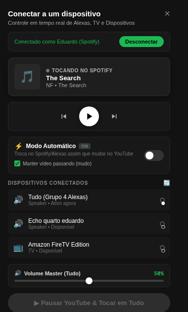
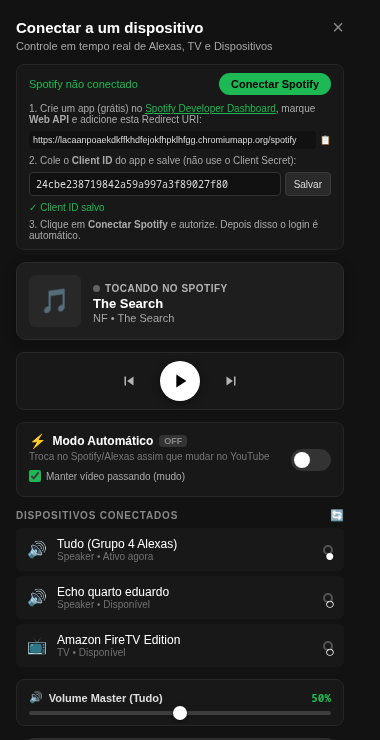

<p align="center">
  
</p>

<h1 align="center">Sync Music — YouTube → Spotify Connect</h1>

<p align="center">
  <strong>Use YouTube e YouTube Music como controle remoto para Spotify Connect, Alexa, Echo, Fire TV e grupos multiroom.</strong>
</p>

<p align="center">
  Chrome Extension · Manifest V3 · Spotify Web API · OAuth PKCE · YouTube / YouTube Music
</p>

<p align="center">
  
  
  
  
</p>

---

## O que é o Sync Music?

O **Sync Music** é uma extensão para Chrome que detecta a música tocando no **YouTube** ou **YouTube Music**, procura a mesma faixa no **Spotify** e envia a reprodução para qualquer dispositivo disponível no **Spotify Connect** — incluindo **Alexa / Echo**, **Fire TV**, caixas compatíveis e grupos multiroom como **Tudo** ou **Casa**.

Em vez de abrir o Spotify e procurar a mesma música manualmente, você continua escolhendo as músicas no YouTube e deixa a extensão fazer o handoff.

**English:** Chrome extension that detects the current YouTube / YouTube Music track and hands it off to Spotify Connect devices such as Alexa, Echo, Fire TV and multi-room speaker groups.

### Exemplo

```text
YouTube / YouTube Music
        ↓
Detecta título + artista
        ↓
Normaliza os metadados
        ↓
Busca a faixa no Spotify
        ↓
Escolhe o melhor match
        ↓
Spotify Connect
        ↓
Alexa / Echo / Fire TV / grupo "Tudo"
```

> ⭐ Se este projeto resolver um problema para você, deixe uma **Star**. Isso ajuda outras pessoas a encontrá-lo no GitHub.

---

## Capturas de Tela do Menu

<p align="center">
  
  &nbsp;&nbsp;&nbsp;&nbsp;
  
</p>

<p align="center">
  <em>Esquerda: Menu ativo com reprodução sincronizada, Alexas conectadas e controle de volume.<br>
  Direita: Card de configuração intuitiva do Spotify Client ID e Redirect URI.</em>
</p>

---

## Destaques

| Recurso | O que faz |
| --- | --- |
| ⚡ **Modo automático** | Troca o Spotify assim que a música muda no YouTube / YouTube Music. |
| ♫ **Handoff manual** | Envia a faixa atual pelo botão no player ou pelo popup. |
| 🔊 **Spotify Connect** | Lista e controla dispositivos Spotify Connect disponíveis. |
| 🏠 **Alexa / multiroom** | Funciona com Echo, Fire TV e grupos Alexa quando aparecem como dispositivo Spotify Connect. |
| 🎬 **Manter vídeo passando** | Deixa o clipe rodando mudo no YouTube enquanto o áudio toca nas caixas. |
| 🧠 **Matching por confiança** | Evita tocar uma versão errada quando título/artista não combinam bem. |
| 🔁 **Latest-wins** | Em trocas rápidas A → B → C, somente a faixa mais recente vence. |
| 📢 **Ignora anúncios** | Não envia títulos de anúncios do YouTube para o Spotify. |
| ✅ **Confirma reprodução** | Consulta `GET /me/player` após o comando para conferir dispositivo, faixa e estado. |
| 🔐 **OAuth PKCE** | Login Spotify sem Client Secret dentro da extensão. |
| 🐞 **Debug e telemetria** | Logs com `correlationId`, estado do handoff, copiar/exportar e diagnóstico. |

---

## Como o modo automático funciona

Com **⚡ Automático ON**:

```text
Música A no YouTube
        ↓
Spotify Connect toca A

Você troca para B
        ↓
Sync Music detecta B
        ↓
Spotify Connect troca para B

Playlist avança para C
        ↓
Spotify Connect acompanha C
```

O detector cobre navegação SPA do YouTube, troca de vídeo, playlist, F5 e ativação do modo automático com uma faixa já tocando.

Também existem proteções para:

- trocas rápidas de música (*latest-wins*);
- anúncios `ad-showing` / `ad-interrupting`;
- páginas sem vídeo (home e busca);
- títulos alterados pela tradução do YouTube;
- falhas transitórias de rede / dispositivo;
- reprodução aceita pelo Spotify mas ainda não visível em `GET /me/player`;
- dispositivo preferido temporariamente indisponível.

---

## Instalação rápida

### 1. Baixe o projeto

```bash
git clone https://github.com/eduardo02138/Reprodo-ao.git
cd Reprodo-ao
```

### 2. Carregue a extensão no Chrome

1. Abra `chrome://extensions`.
2. Ative **Modo do desenvolvedor**.
3. Clique em **Carregar sem compactação**.
4. Selecione a pasta deste repositório.

### 3. Configure o Spotify pelo próprio popup

No card **Conta Spotify**:

1. Crie gratuitamente um app no [Spotify Developer Dashboard](https://developer.spotify.com/dashboard).
2. Ative a **Web API** no app.
3. Copie a **Redirect URI** exibida pela extensão e cadastre-a exatamente no app Spotify.
4. Copie apenas o **Client ID** e cole no campo da extensão.
5. Clique em **Salvar**.
6. Clique em **Conectar Spotify** e autorize.

> **Nunca cole o Client Secret.** Esta extensão usa OAuth 2.0 com PKCE e precisa somente do Client ID público.

Cada instalação unpacked pode ter um ID de extensão diferente e, consequentemente, uma Redirect URI diferente.

### Requisitos

- Google Chrome / Chromium compatível com Manifest V3.
- Conta **Spotify Premium** para os controles de reprodução da Web API.
- Pelo menos um dispositivo visível no Spotify Connect.

Se uma Alexa não aparecer, iniciar Spotify nela (`Alexa, tocar Spotify`) normalmente faz o dispositivo aparecer novamente no Spotify Connect.

---

## Conta Spotify e Client ID

O projeto não distribui um Client ID global fixo. Cada usuário configura seu próprio app Spotify pelo popup.

Isso traz três vantagens:

- você não precisa editar nenhum arquivo do projeto;
- sua autenticação não depende da conta de desenvolvedor de outra pessoa;
- os tokens permanecem associados ao Client ID que os emitiu.

Se você trocar o Client ID salvo, a extensão encerra a sessão atual para impedir que tokens de um app sejam reutilizados por outro.

### Login automático

Depois da primeira autorização, a extensão pode tentar restaurar a sessão silenciosamente quando o refresh token deixa de funcionar. Se o Spotify exigir interação do usuário, o estado passa para **AUTH_REQUIRED** e o popup volta a oferecer **Conectar Spotify**.

Depois de clicar explicitamente em **Desconectar**, a reautenticação automática fica desativada até uma nova conexão manual.

---

## Alexa, Echo, Fire TV e grupos multiroom

O Sync Music não transmite áudio diretamente para a Alexa. Ele usa o **Spotify Connect** como camada de saída.

Portanto, o destino precisa aparecer em:

```text
Spotify → Dispositivos disponíveis
```

Exemplos de destinos:

- Echo / Alexa individual;
- Fire TV;
- caixas compatíveis com Spotify Connect;
- grupos multiroom Alexa expostos ao Spotify, como `Tudo` ou `Casa`.

Se o destino escolhido desaparecer, a extensão evita tocar silenciosamente em um dispositivo aleatório.

---

## Vídeo pausado ou vídeo passando mudo

No card do **Modo Automático** existe a opção:

```text
☐ Manter vídeo passando (mudo)
```

Desmarcada:

```text
YouTube pausa + fica mudo
Spotify / Alexa toca o áudio
```

Marcada:

```text
YouTube continua mostrando o clipe em silêncio
Spotify / Alexa toca o áudio
```

Isso é útil para quem quer assistir ao videoclipe no PC enquanto escuta pela sala inteira.

---

## Por que este projeto é diferente?

Existem extensões para converter playlists, controlar o Spotify ou abrir uma música do YouTube no Spotify. O foco aqui é outro: criar um **handoff automático e contínuo** entre a experiência de descoberta do YouTube e a infraestrutura de dispositivos do Spotify Connect.

O pipeline principal é:

```text
Track Detector
      ↓
Normalizer
      ↓
Auto Mode Policy
      ↓
Latest-Wins Queue
      ↓
Single Handoff Executor
      ↓
Spotify Matcher
      ↓
Target Resolver
      ↓
Spotify Play
      ↓
Playback Verification
```

Manual e automático convergem para o mesmo executor, evitando duas implementações concorrentes do handoff.

---

## Testes

### Unitários

```bash
npm test
```

Os testes exercitam o `background/service-worker.js` real com `chrome.*` e Spotify simulados, incluindo:

- modo automático;
- F5 e navegação;
- fila *latest-wins*;
- retry de falhas transitórias;
- matching;
- dispositivo preferido;
- confirmação de playback;
- OAuth PKCE;
- refresh / 401;
- refresh concorrente;
- silent re-auth;
- troca de Client ID;
- telemetria;
- modo de vídeo mudo.

### E2E

```bash
npm install
npm run test:e2e
```

O E2E carrega **este próprio repositório** como extensão no Chromium, navega no YouTube real e intercepta a API do Spotify para não iniciar reprodução nas suas caixas durante o teste.

Caso o Chromium do Playwright ainda não esteja instalado:

```bash
npx playwright install chromium
```

Também é possível informar um binário manualmente:

```bash
CHROMIUM_PATH=/caminho/para/chromium npm run test:e2e
```

Saídas e capturas ficam em `tests/e2e/.output/`.

---

## Arquitetura

```text
manifest.json
│
├── background/
│   └── service-worker.js      # autoridade do handoff, queue, state machine e auth
│
├── content/
│   ├── youtube.js             # YouTube/YouTube Music, MediaSession, SPA e vídeo
│   └── track-normalizer.js    # normalização de metadados
│
├── providers/
│   └── spotify-provider.js    # busca, dispositivos, playback e transferência
│
├── shared/
│   ├── spotify-client.js      # Web API, refresh, 401, 429 e retry
│   ├── auth.js                # OAuth PKCE
│   ├── spotify-config.js      # escopos e storage keys
│   ├── confidence-engine.js   # matching YouTube → Spotify
│   └── logger.js              # telemetria
│
├── popup/                     # UI / configuração / controles
└── tests/
    ├── unit/
    └── e2e/
```

---

## Segurança

- Nenhum **Client Secret** deve ser colocado na extensão.
- Client ID e tokens ficam no `chrome.storage.local` do navegador.
- Tokens são vinculados ao app/Client ID que os emitiu.
- Refresh concorrente é serializado para lidar com rotação de refresh tokens.
- Logout explícito impede login automático inesperado.

<details>
<summary><strong>Nota sobre o histórico do repositório</strong></summary>

Commits antigos (`08ec4cd`, `72bb9fc` e `06d59bc`) chegaram a conter tokens reais do Spotify em `shared/default-token.json`. Se aqueles tokens pertenciam à sua conta, revogue o acesso correspondente na página de apps conectados do Spotify.

</details>

---

## Limitações conhecidas

- O handoff não é sincronização audiovisual perfeita; Spotify e YouTube são reproduções independentes.
- Alexas e grupos podem levar alguns segundos para aparecer como ativos no Spotify Connect.
- O match depende dos metadados disponíveis no vídeo. Títulos muito fora do padrão podem ficar abaixo da confiança mínima.
- Títulos já traduzidos quando o vídeo abre podem dificultar a busca da versão original.
- A detecção de anúncios depende de sinais do player do YouTube e pode precisar de ajustes quando a interface do site mudar.
- Alguns dispositivos, incluindo determinadas TVs, não expõem controle de volume pela Web API.

---

## Para desenvolvedores

Tecnologias e conceitos usados no projeto:

`Chrome Extension` · `Manifest V3` · `JavaScript` · `Spotify Web API` · `Spotify Connect` · `OAuth 2.0 PKCE` · `YouTube` · `YouTube Music` · `MediaSession` · `Playwright` · `Node.js`

Contribuições, bug reports e ideias são bem-vindos. Ao abrir uma issue, inclua quando possível:

- navegador e versão;
- YouTube ou YouTube Music;
- dispositivo Spotify Connect usado;
- trecho de telemetria sem tokens;
- passos para reproduzir.

---

## Roadmap

Algumas próximas evoluções possíveis:

- publicação na Chrome Web Store;
- CI obrigatório com testes unitários e E2E;
- screenshots / GIF de demonstração no README;
- instalador e onboarding mais simples;
- maior cobertura de YouTube Music;
- suporte a mais provedores de saída através da abstração de providers.

---

## Ajude o projeto a crescer

Se você chegou aqui procurando por **YouTube to Spotify Connect**, **YouTube Music to Alexa**, **Chrome extension for Spotify Connect**, **YouTube Alexa multiroom**, **Echo Spotify Connect** ou **YouTube Music handoff**, este projeto foi criado exatamente para esse tipo de uso.

Se foi útil:

- ⭐ dê uma **Star** no repositório;
- 🍴 faça um **Fork** para experimentar novas integrações;
- 🐛 abra uma **Issue** para bugs reproduzíveis;
- 💡 compartilhe ideias de dispositivos e providers;
- 🔗 compartilhe o projeto com quem usa YouTube + Spotify + Alexa.

---

## Licença

MIT.
